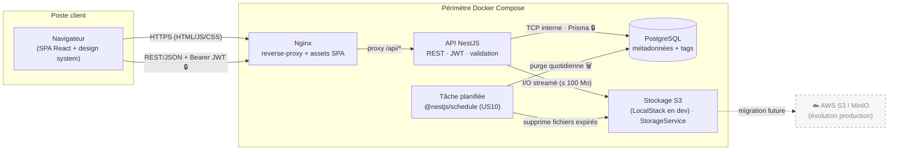
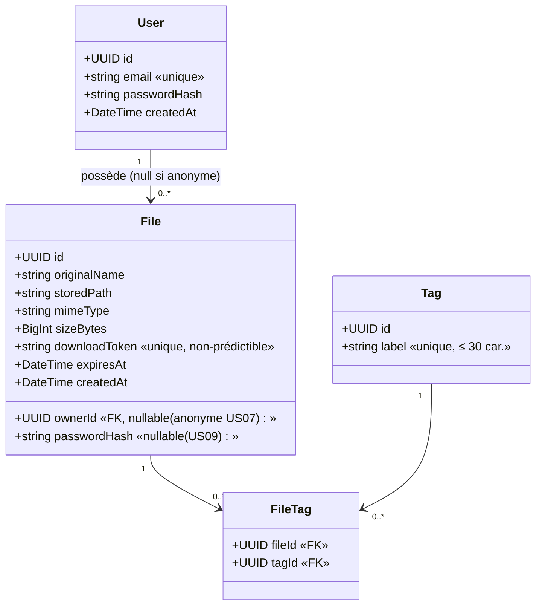

# DataShare — Documentation technique

> Prototype de plateforme de transfert de fichiers (type WeTransfer).
> Périmètre : **MVP US01 → US06 + fonctionnalités avancées US07 → US10** (upload anonyme, tags,
> mot de passe fichier, expiration automatique). Les éléments avancés portent le badge **(avancé)**.

| | |
|---|---|
| **Stack** | NestJS (TypeScript) · React 19 (Vite) · PostgreSQL · stockage fichiers local · Docker Compose |
| **Auth** | JWT (email + mot de passe) |
| **Statut** | Prototype — démo investisseurs |

---

## Sommaire

1. [Architecture de l'application (diagramme simple)](#1--architecture-de-lapplication-diagramme-simple)
2. [Choix technologiques justifiés](#2--choix-technologiques-justifiés)
3. [Modèle de données](#3--modèle-de-données)
4. [Documentation d'API](#4--documentation-dapi)
5. [Sécurité et gestion des accès](#5--sécurité-et-gestion-des-accès)
6. [Qualité, tests et maintenance](#6--qualité-tests-et-maintenance)
7. [Processus d'installation et d'exécution](#7--processus-dinstallation-et-dexécution)
8. [Utilisation de l'IA dans le développement](#8--utilisation-de-lia-dans-le-développement)

---

## 1 — Architecture de l'application (diagramme simple)

DataShare est une application web **client-serveur** orchestrée par Docker Compose : une **SPA React**
(Vite + TypeScript + **design system maison** : tokens **CSS** `--ds-*` et composants `src/ui`) servie par
**Nginx**, une **API REST NestJS**, et une base **PostgreSQL**. Les fichiers binaires sont stockés sur un
**stockage objet S3** (émulé par **LocalStack** en développement ; jamais en base), derrière une abstraction
`StorageService` à **pilote interchangeable** (`STORAGE_DRIVER` = `local` ou `s3`) → on change de backend de
stockage sans toucher au métier. Une **tâche planifiée** purge quotidiennement les fichiers expirés (US10).



**Légende**
- **Rectangle plein** = service/conteneur · **cylindre** = base de données · **🔒** = échange sécurisé (JWT/TLS).
- **Flèche pleine** = flux applicatif · **flèche pointillée** = évolution future (non implémentée).
- Cadre `Périmètre Docker Compose` = réseau interne ; seul Nginx est exposé à l'extérieur.

**Flux principaux**
- **Authentification** : `POST /api/auth/login` → JWT joint en `Authorization: Bearer …` (guard NestJS).
- **Upload (US01 connecté / US07 anonyme)** : fichier multipart **streamé** vers le `StorageService` (≤ 100 Mo) ;
  métadonnées + **token non-prédictible** persistés. En anonyme, le fichier n'est lié à aucun compte.
- **Téléchargement (US02)** : `GET /api/files/:token/download` ; vérification expiration + mot de passe (US09).
- **Expiration auto (US10)** : un cron quotidien supprime fichiers + métadonnées arrivés à expiration.

**Organisation du code front-end** (`front/src/`)

| Dossier | Rôle |
|---------|------|
| `pages/` | Un composant par écran (upload, connexion, inscription, espace, téléchargement) |
| `ui/` | **Design system** : composants réutilisables (Button, Input, Select, Callout, FileRow…) + tokens CSS |
| `core/` | Services transverses : contexte d'authentification, route protégée, client HTTP (intercepteurs JWT/401), layout |
| `api/` | Client d'API **généré par orval** depuis le contrat OpenAPI (hooks TanStack Query typés) — jamais édité à la main |

**Gestion d'état** : l'état **serveur** (fichiers, tags) est géré par **TanStack Query** (cache,
invalidation, re-fetch) ; l'état **UI local** par les hooks React (`useState`) ; la **session** par un
contexte React adossé au `localStorage`. Aucune bibliothèque d'état global supplémentaire n'est
nécessaire à cette échelle.

---

## 2 — Choix technologiques justifiés

| Élément | Technologie choisie | Alternatives envisagées | Justification |
|---------|---------------------|-------------------------|---------------|
| **Back-end** | **NestJS** (TypeScript) | Spring Boot, .NET Core, Symfony | Architecture modulaire (modules/DI/décorateurs) ; OpenAPI **auto-généré** (`@nestjs/swagger`) ; `npm audit` **unifié** front+back ; TypeScript de bout en bout |
| **Front-end** | **React 19** (Vite + TypeScript) | Vue.js, Svelte | **Écosystème de référence** et **employabilité** (compétences front les plus demandées, plus large communauté/bibliothèques) ; **DTO + client typé partagés** avec NestJS via **orval** (contrat OpenAPI) ; outillage **Vite** (démarrage et HMR quasi instantanés) |
| **Design system** | **Maison** : tokens **CSS** (`--ds-*`) + composants React `src/ui` ; police **DM Sans** | Material UI, Tailwind | Fidélité **sur-mesure** aux maquettes Figma (marque orange, dégradé, composants spécifiques) ; tokens CSS **agnostiques du framework** (la bascule du front n'a pas touché au design) |
| **Base de données** | **PostgreSQL** | MongoDB | Données **relationnelles** (users ↔ fichiers ↔ tags) ; intégrité par clés étrangères ; **ACID** pour suppression en cascade |
| **Stockage fichiers** | **Stockage objet S3** (LocalStack en dev) ; pilote `local` conservé | FS local seul, MinIO | Abstraction `StorageService` à **pilote interchangeable** (`STORAGE_DRIVER=local\|s3`) → bascule sans impact métier ; **parité dev/prod** via un protocole S3 réel émulé par LocalStack (`@aws-sdk/client-s3`) |
| **ORM** | **Prisma** | TypeORM | **Type-safe**, migrations versionnées ; le schéma = **source de vérité** du modèle de données |
| **Authentification** | **JWT** (`@nestjs/jwt` + Passport) ; hash **argon2** | Sessions ; bcrypt | JWT imposé par les specs ; **stateless** ; argon2 = standard moderne de hachage |
| **Tâches planifiées** | **`@nestjs/schedule`** (cron) | cron système, BullMQ | Purge quotidienne des fichiers expirés (US10), intégré à NestJS, zéro infra supplémentaire |
| **Conteneurisation** | **Docker Compose** (2 fichiers : prod + tests) | Exécution native | Parité dev/prod, reproductibilité, onboarding immédiat |
| **Outils dev** | Git (**conventional commits**), ESLint + Prettier, npm | — | Historique propre, qualité homogène |
| **Tests** | **Jest + Supertest** (back) · **Vitest + React Testing Library** (front) | Karma, Cypress | Défauts modernes des écosystèmes NestJS / **Vite-React** ; couverture intégrée (seuil **70 %**) |
| **Performance** | **k6** | JMeter, Artillery | Scriptable JS, léger, adapté au test d'un endpoint critique |

**Pourquoi NestJS plutôt que Spring Boot ?** Pour un prototype « simple mais robuste », NestJS offre une
structure modulaire éprouvée en gardant **un seul langage (TypeScript)**. Bénéfices directs sur
les livrables : **OpenAPI** généré depuis les décorateurs (`@nestjs/swagger`) et **scan sécurité** unique
(`npm audit`) front comme back.

**Pourquoi React (sur mérite) ?** React est le **standard de fait** du front : la plus large communauté, le
plus grand choix de bibliothèques et les **compétences les plus recherchées** sur le marché — un atout direct
d'**employabilité** et de pérennité pour le recrutement. Le **contrat-first** (OpenAPI NestJS → client typé
généré par **orval**) rend le partage de types **indépendant du framework front** : on conserve le bénéfice
« un seul langage, zéro duplication » côté back comme front. On retient un **React « nu »** (Vite, sans
Next.js/RSC) pour ne pas faire **doublon** avec l'API NestJS, et l'accessibilité (exigence PSH) est assurée
par du **HTML sémantique + attributs ARIA** dans le design system maison.

**Pourquoi PostgreSQL plutôt que MongoDB ?** Modèle fortement relationnel (un utilisateur possède plusieurs
fichiers ; un fichier porte plusieurs tags via une table de liaison). Clés étrangères + transactions ACID
garantissent l'intégrité, notamment à la **suppression** (US06) et à la **purge** (US10).

---

## 3 — Modèle de données

Notation **UML (diagramme de classes)**. Source de vérité : `back/prisma/schema.prisma`.
Important : **le binaire est sur disque** (`storedPath`) ; seules les **métadonnées** sont en base.



**Entités**
- **User** — compte. `email` unique ; `passwordHash` (argon2).
- **File** — fichier déposé. `downloadToken` = identifiant **non-prédictible** du lien ; `passwordHash`
  optionnel (US01/US09) ; `expiresAt` ≤ 7 j ; `ownerId` **nullable** → `null` pour un upload **anonyme** (US07).
- **Tag** *(avancé US08)* — étiquette libre, `label` unique (≤ 30 car.).
- **FileTag** *(avancé US08)* — table de liaison **N:M** entre `File` et `Tag` ; PK composite `(fileId, tagId)`
  → empêche les doublons de tag sur un même fichier.

**Schéma Prisma (source de vérité)**

```prisma
model User {
  id           String   @id @default(uuid())
  email        String   @unique
  passwordHash String
  createdAt    DateTime @default(now())
  files        File[]
}

model File {
  id            String    @id @default(uuid())
  owner         User?     @relation(fields: [ownerId], references: [id], onDelete: Cascade)
  ownerId       String?
  originalName  String
  storedPath    String
  mimeType      String
  sizeBytes     BigInt
  downloadToken String    @unique
  passwordHash  String?
  expiresAt     DateTime
  createdAt     DateTime  @default(now())
  tags          FileTag[]

  @@index([ownerId])
  @@index([expiresAt])
}

model Tag {
  id    String    @id @default(uuid())
  label String    @unique
  files FileTag[]
}

model FileTag {
  file   File   @relation(fields: [fileId], references: [id], onDelete: Cascade)
  fileId String
  tag    Tag    @relation(fields: [tagId], references: [id], onDelete: Cascade)
  tagId  String

  @@id([fileId, tagId])
}
```

---

## 4 — Documentation d'API

Architecture **REST**. Contrat **auto-généré** par `@nestjs/swagger` :

- **Swagger UI** : `http://localhost:3000/api/docs`
- **Spécification OpenAPI** versionnée : [`docs/openapi.json`](./openapi.json) — source du client typé front (orval)

### Endpoints principaux

| Méthode | Route | Auth | Description | US |
|---------|-------|------|-------------|----|
| `POST` | `/api/auth/register` | public | Création de compte | US03 |
| `POST` | `/api/auth/login` | public | Connexion → JWT | US04 |
| `POST` | `/api/files` | **JWT ou anonyme** | Upload multipart + options (expiration, mot de passe, tags) → token | US01 · US07 · US09 |
| `GET` | `/api/files` | JWT | Historique de l'utilisateur — filtre `?tag=` | US05 · US08 |
| `GET` | `/api/files/:token` | public | Métadonnées avant téléchargement | US02 |
| `POST` | `/api/files/:token/verify` | public | Vérifie le mot de passe d'un fichier protégé | US02 · US09 |
| `GET` | `/api/files/:token/download` | public | Téléchargement (streamé) | US02 |
| `DELETE` | `/api/files/:id` | JWT (propriétaire) | Suppression du fichier + métadonnées | US06 |
| `GET` | `/api/tags` | JWT | Liste des tags de l'utilisateur (filtrage) | US08 |

### Exemple — upload (US01 / US07)

```http
POST /api/files
Authorization: Bearer <JWT>   # absent si upload anonyme (US07)
Content-Type: multipart/form-data

file=<binaire>&expiresInDays=7&password=<optionnel>&tags=facture,2026
```

```json
// 201 Created
{
  "downloadToken": "8f3a…non-prédictible",
  "downloadUrl": "https://datashare.app/d/8f3a…",
  "originalName": "rapport.pdf",
  "sizeBytes": 524288,
  "expiresAt": "2026-06-16T10:00:00Z",
  "passwordProtected": false,
  "tags": ["facture", "2026"]
}
```

---

## 5 — Sécurité et gestion des accès

**Authentification** — JWT. À la connexion, l'API vérifie email + mot de passe et émet un **JWT signé**
(secret en variable d'environnement, durée de vie limitée). Routes protégées via **stratégie Passport JWT**
(`JwtAuthGuard`) ; token transmis en `Authorization: Bearer …`.

**Gestion des accès / rôles** — Pas de rôle administrateur. Contrôle par **propriété (ownership)** : un
utilisateur ne **consulte/supprime que ses propres fichiers** (US05/US06). Les **uploads anonymes** (US07)
ne sont liés à aucun compte → aucun historique ni gestion (lien = seul moyen d'accès). Les liens publics
(US02) restent accessibles à quiconque détient le token valide.

**Mesures de sécurisation**
- **Hachage** des mots de passe utilisateur **et** fichier (argon2 + sel) ; jamais en clair ni réversibles.
- **Token de téléchargement non-prédictible** (`crypto.randomBytes` / nanoid) → ni devinable ni énumérable.
- **Validation client ET serveur** : **formulaires contrôlés React** (règles partagées via `@datashare/shared`) + `ValidationPipe` NestJS `whitelist` + `class-validator`.
- **HTTPS** en production (TLS au reverse-proxy) · **Helmet** (en-têtes) · **CORS** restreint à l'origine du front.

**Limites & protections**
- **Taille max d'upload : 100 Mo** (Multer côté NestJS + `client_max_body_size` Nginx).
- **Extensions interdites** (`.exe`, `.bat`, …) — contrôle par **extension** du nom de fichier.
- **Expiration** ≤ 7 jours (validée serveur) ; **purge automatique** quotidienne (US10).
- **Mots de passe** : utilisateur ≥ 8 car. ; mot de passe de fichier ≥ 6 car. (US09).
- **Tags** (US08) : `label` ≤ 30 car., sans doublon par fichier (contrainte PK composite).
- **Rate-limiting** (`@nestjs/throttler`) sur `login`, `upload` et `verify` — **important** car l'upload anonyme
  (US07) et la vérification de mot de passe sont exposés sans authentification.

> Détail du scan de vulnérabilités et analyse dans [`SECURITY.md`](../SECURITY.md).

---

## 6 — Qualité, tests et maintenance

Suivi qualité réparti dans quatre fichiers du dossier `docs/`. Résumé :

**[`TESTING.md`](./TESTING.md)** — Plan de tests — **126 tests verts** + 1 parcours Cypress (exécution 2026-07-18)
- **Unitaires back** : **Jest**, 54 tests (services auth/files/storage/tags/purge, contrôleurs, guards, pilotes de
  stockage, filtre d'exception upload, nettoyage staging) — couverture **95 % lignes** (seuil 70 % imposé par `coverageThreshold`).
- **Intégration API** : **Supertest**, 21 tests contre une **vraie base PostgreSQL** — parcours critiques
  US01-US10 rejoués de bout en bout : `inscription → connexion → upload → lien` ; `téléchargement avec/sans
  mot de passe` ; `suppression + ownership` ; `upload anonyme` (US07) ; `tags + filtre` (US08) ; `expiration
  410 + purge` (US10) ; `429 sur abus de login`.
- **Front** : **Vitest + React Testing Library**, 51 tests (composants `src/ui`, contexte d'auth, route protégée,
  mutateur API/JWT + interception 401, pages connexion/inscription/espace/upload/téléchargement) — couverture **91 % lignes** (seuil 70 %).
- **E2E navigateur** : **Cypress**, 1 parcours critique (inscription → upload → téléchargement → historique),
  exécution manuelle contre la stack Docker.
- **Accessibilité (PSH)** : composants natifs + focus visible + ARIA ; audit Lighthouse recommandé.
- **Critères d'acceptation** mappés sur **US01-US10** ; **instructions d'exécution** (locales et conteneurisées
  via `compose.test.yaml`) ; **captures des rapports de couverture** incluses dans [`docs/reports/`](./reports/).

**[`SECURITY.md`](./SECURITY.md)** — Garantie de sécurité
- Scan `npm audit` (front + back) ; analyse succincte des résultats et décisions (mises à jour, risques acceptés).

**[`PERF.md`](./PERF.md)** — Suivi de performance
- Test **k6** sur un endpoint critique (ex. téléchargement) : scénario, résultats (p95, RPS, taux d'erreur), interprétation.
- **Budget perf front** : taille du bundle (**build Vite**), métriques navigateur (LCP/TTI) ; captures de logs/métriques.

**[`MAINTENANCE.md`](./MAINTENANCE.md)** — Maintenance
- Procédure **manuelle** de mise à jour des dépendances (`npm outdated` / `npm update`), fréquence, risques
  (breaking changes) et garde-fous (tests de non-régression, rejoués par la CI à chaque push).

> ✅ `TESTING.md` (126 tests, couvertures réelles + captures, + 1 parcours Cypress), `SECURITY.md` (front :
> **0 vulnérabilité livrée** ; back : 6 advisories transitives NestJS, **atténuées**) et `PERF.md` (**k6 exécuté** :
> ≈ 3 073 req/s, p95 = 26 ms, 0 % d'erreur) sont alimentés en résultats réels. Les tests back+front sont rejoués
> automatiquement à chaque push (`.github/workflows/ci.yml`).

---

## 7 — Processus d'installation et d'exécution

> Résumé ; voir le [`README.md`](../README.md) pour le détail complet.

**Prérequis**
- Docker Engine **24+** et Docker Compose **v2**
- Node **20+** (développement hors conteneur)
- Ports libres : **4200** (front), **3000** (API), **5433** (PostgreSQL, port hôte publié)

**Commandes principales**

```bash
# 1. Configurer l'environnement
cp .env.example .env

# 2. Lancer (production / démo)
docker compose up --build            # ajouter -d pour l'arrière-plan

# 3. Développement local (hot reload, hors conteneur)
npm run start:dev -w @datashare/back   # API :3000
npm start -w front                     # front :4200 (proxy /api → :3000)

# 4. Migrations de base de données
docker compose exec back npx prisma migrate deploy

# 5. Tests (isolés)
docker compose -f compose.test.yaml run --rm back-test
docker compose -f compose.test.yaml run --rm front-test
```

**Variables d'environnement (`.env`)**

| Variable | Rôle |
|----------|------|
| `POSTGRES_DB` / `POSTGRES_USER` / `POSTGRES_PASSWORD` | Base PostgreSQL |
| `DATABASE_URL` | Chaîne de connexion Prisma |
| `JWT_SECRET` / `JWT_EXPIRES_IN` | Signature et durée de vie des JWT |
| `STORAGE_DRIVER` | Pilote de stockage : `local` (disque) ou `s3` |
| `STORAGE_PATH` | Répertoire de staging local (et stockage final en pilote `local`) |
| `S3_ENDPOINT` / `S3_REGION` / `S3_BUCKET` | Stockage objet S3 (LocalStack en dev) — pilote `s3` |
| `AWS_ACCESS_KEY_ID` / `AWS_SECRET_ACCESS_KEY` / `S3_FORCE_PATH_STYLE` | Identifiants et style d'URL S3 |
| `PURGE_CRON` | Planification de la purge des fichiers expirés (US10, ex. quotidienne) |
| `THROTTLE_TTL_MS` / `THROTTLE_LIMIT` | Fenêtre et plafond du rate-limiting global (défaut 100 req/min — relevables pour un bench, voir `PERF.md`) |
| `FRONT_URL` | Origine autorisée (CORS) + base des liens de téléchargement |

> Les **limites** (taille max d'upload **100 Mo**, expiration par défaut **7 j**) sont des **constantes** versionnées dans `@datashare/shared` (partagées back ↔ front), **pas** des variables d'environnement.

> ✅ **Vérifié** (2026-06-25) : `cp .env.example .env && docker compose up --build` → migration appliquée
> automatiquement, front joignable sur `:4200`, Swagger sur `:3000/api/docs`, chaîne complète
> navigateur → nginx → API → PostgreSQL et **stockage S3 (LocalStack)** testée (upload → bucket → download).

---

## 8 — Utilisation de l'IA dans le développement

**Posture adoptée** — Approche **combinée** : l'IA comme **développeur junior** (tâches cadrées, code **revu**)
et comme **binôme** lors de la conception (architecture, choix techniques, modèle de données).

**Tâches confiées à l'IA**
- Conception : analyse des specs, comparaison des stacks, structuration de la documentation.
- **Design system** : extraction depuis les **maquettes Figma** (tokens couleurs/typo/radius depuis les SVG,
  inventaire des composants) et génération des composants React `src/ui`.
- Implémentation : scaffolding NestJS/React, développement des US (y compris avancées), intégration Prisma/JWT/upload/cron.
- Tests & doc : génération de tests (Vitest/React Testing Library/Jest), rédaction de cette doc, contrat OpenAPI, configs Docker.

**Supervision et corrections apportées**
- **Revue de code systématique** avant intégration, complétée par une **revue technique exhaustive**
  avant livraison (audit par dimensions + vérification adversariale + exécution réelle) — méthode,
  constats confirmés et corrections consignés dans [`REVUE-CODE-IA.md`](./REVUE-CODE-IA.md).
- Ajustements **sécurité** (argon2, validation `whitelist`, tokens non-prédictibles, rate-limiting),
  **performance**, **lisibilité**, et **fidélité aux maquettes** (ex. correction d'icône, du segmented).
- Règle de style : **pas de commentaires superflus** — le code doit être auto-explicatif.

**Apports et limites constatés**
- **Apports** : gain de temps (boilerplate, tests, doc), aide à la décision d'architecture, cohérence de style.
- **Limites** : incohérences/sur-ingénierie occasionnelles ; risque d'**API hallucinées** → vérification via la
  **documentation officielle** (Context7) et l'exécution réelle (build, tests, rendu).

**Exemples concrets de corrections (supervision en action)**
- **Rate-limiting inactif** : l'IA avait configuré `ThrottlerModule` **sans brancher le `ThrottlerGuard`
  global** — les décorateurs `@Throttle` étaient donc sans effet. Détecté lors de l'écriture des tests
  d'intégration, corrigé (`APP_GUARD`) et **verrouillé par un test** (429 sur abus de login).
- **Fidélité aux maquettes** : icône d'erreur (octogone, pas un cercle) et filtre segmenté (bords intérieurs
  droits) corrigés après revue visuelle contre le Figma.
- **UX des formulaires** : la soumission invalide était silencieuse — correction (`markAllAsTouched` +
  affichage des erreurs par champ dans `ds-input`), vérifiée par tests.
